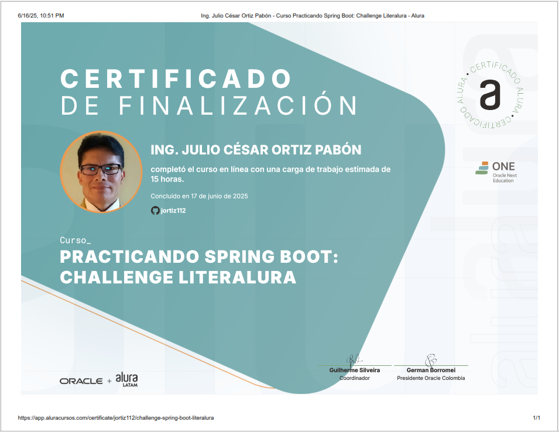

***
# <h1 align="center"> 💥Consultor de Películas Star Wars con SWAPI💥 </h1>
***


## 📄Descripción del proyecto

```sh

Nombre del proyecto: Star Wars API Console App
Lenguaje: Java
Paradigma: Programación Orientada a Objetos
Dependencias externas: Gson (para serialización/deserialización JSON)
Fuente de datos: SWAPI - Star Wars API
Interfaz de usuario: Consola interactiva

```

## 📃Objetivos de aprendizaje

```sh

- El propósito de esta aplicación es permitir al usuario explorar información sobre las películas del 
  universo Star Wars a través de una interfaz de consola. El usuario puede seleccionar una película 
  por su número de episodio (del 1 al 6), consultar los detalles obtenidos desde la API oficial de 
  Star Wars (SWAPI), verlos formateados en consola, y guardar todas las películas consultadas en un 
  único archivo JSON llamado starwars.json.

```

## 🛠️Recursos y herramientas utilizados

```sh

- Trello: para organizar las tareas y el progreso del proyecto.
- Discord: para comunicarse con los compañeros y aclarar dudas.
- Cursos y formaciones de Alura Latam: para consultar contenidos relevantes y obtener más información.
- GitHub: para publicar y compartir el código del proyecto.
- LinkedIn: para conectarse con la comunidad y mostrar el aprendizaje adquirido.

```

## 📗Funcionalidad del Conversor de Monedas

```sh

1. Menú interactivo: El usuario puede seleccionar repetidamente películas del 1 al 6 o salir de la 
   aplicación.

2. Consumo de API REST: Se realiza una petición HTTP al endpoint de SWAPI para recuperar los datos 
   de la película seleccionada.

3. Modelado de datos con record: Los datos de cada película se encapsulan en un record de Java 
   llamado Pelicula, que representa una estructura inmutable y concisa.

4. Acumulación de resultados: Todas las películas consultadas en una sesión se almacenan en memoria 
   y se escriben juntas en un archivo JSON al salir.

5. Serialización con Gson: Se utiliza la biblioteca Gson para convertir los objetos Java a JSON y 
   almacenarlos en disco.

6. Diseño limpio: El código está organizado por paquetes siguiendo principios SOLID. La clase 
   principal (Main) solo orquesta llamadas a servicios, manteniendo la lógica desacoplada y 
   modular.


```
## 📂 Archivos generados

- starwars.json: Archivo que contiene un arreglo JSON con todas las películas consultadas en 
  la sesión.

## 🧱Tecnologías Utilizadas

✔️☕ Oracle Java OpenJDK 21.0.6

✔️🛠️ IntelliJ IDEA 2025 1.1.1

✔️🌐 SWAPI API

✔️📦 Gson (para deserialización de JSON gson-2.13.1.jar)

✔️✅ Estructura de carpetas orientada a paquetes lógicos: modelos, servicios, menu, utilidades, principal.

## 🙏Contribuciones

>> Si deseas contribuir al proyecto, siéntete libre de hacer un fork del repositorio y enviar un pull request con tus mejoras o sugerencias.

## 🔆Resultados del Consultor de Películas Star Wars con SWAPI

>> 

>> 

>> 

>> 

>> 

>> 

>> 

>> 

>> 

## 👩👨Autores del Proyecto

>>     Programación Java POO, diagrama UML
>                               
>>>   Desafio puesto

## 📜Certificado

