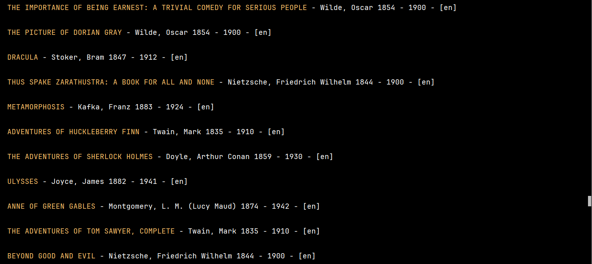
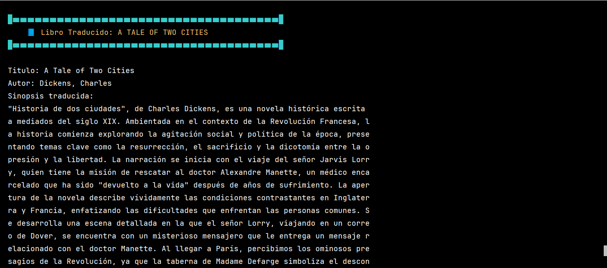
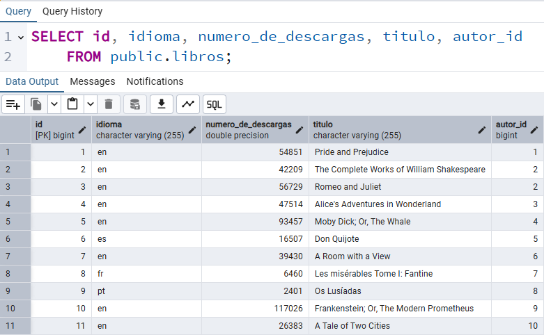

***
# <h1 align="center"> 💥Challenge Literalura - Catálogo de Libros y Consumo de API Gutendex💥 </h1>
***


## 📄Descripción del proyecto

```sh

Literalura es una aplicación desarrollada en Java que permite consultar, registrar y gestionar
libros utilizando el API pública de GutenDex, una API gratuita que proporciona metadatos sobre 
libros del Proyecto Gutenberg. La aplicación se desarrolla utilizando tecnologías como Java, 
Spring y PostgreSQL.

```

## 📃Objetivos del proyecto

```sh

- Consumir servicios REST (API) utilizando Java moderno (HttpClient).
- Practicar conceptos de programación orientada a objetos (POO): encapsulamiento, cohesión, bajo 
  acoplamiento, separación de responsabilidades.
- Persistir información en una base de datos PostgreSQL utilizando Spring Data JPA.
- Aplicar buenas prácticas de diseño de menús interactivos en consola usando Scanner.
- Manejo de errores personalizados y robustez ante fallos de red o de formato.
- Realizar una traducción automática de sinopsis usando una API de IA externa (por ejemplo, Gemini
  de Google).

```

## 🧠 Objetivos de aprendizaje

```sh

- Comprender cómo estructurar una aplicación Java con arquitectura limpia.
- Aplicar el concepto de POO real en un proyecto funcional.
- Aprender a consumir y procesar datos de un API externa.
- Persistencia de datos en PostgreSQL utilizando JPA.
- Traducción automática de contenido textual mediante inteligencia artificial.
- Gestionar errores personalizados, excepciones.
- Interacción con el usuario mediante menús intuitivos en consola.

```

## 🛠️Recursos y herramientas utilizados

```sh

- Trello: para organizar las tareas y el progreso del proyecto.
- Discord: para comunicarse con los compañeros y aclarar dudas.
- Cursos y formaciones de Alura Latam: para consultar contenidos relevantes y obtener más 
  información.
- GitHub: para publicar y compartir el código del proyecto.
- LinkedIn: para conectarse con la comunidad y mostrar el aprendizaje adquirido.
- Chatgpt, DeepSeek para consultas y depuración de errores
- Spring Initializr(https://start.spring.io/)
- Sistema operativo Windows 11 pro 24H2

```

## 📗Funcionalidad del Challenge Literalura - Catálogo de Libros y Consumo de API Gutendex

```sh

1. Buscar libros por nombre desde el API Gutendex. El usuario puede ingresar el nombre de un 
   libro y la aplicación buscará en la API para registrar la información en la base de datos.

2. Registrar automáticamente libros y autores encontrados en la base de datos Postgresql.

3. Evitar duplicados por título al insertar en la base.

4. Listar libros registrados: Permite ver todos los libros que han sido añadidos a la base de
   datos.

5. Listar autores registrados: Muestra todos los autores que tienen libros en la plataforma.

6. Listar autores vivos en un año específico: Permite consultar qué autores estaban vivos en 
   un año determinado.

7. Listar libros por idioma: El usuario puede buscar libros según el idioma en que están 
   escritos.

8. Listar libros y autores en un rango de fechas desde la API, Obtener los top 10 libros más
   descargados desde API, Se busca el autor po nombre desde la Base de datos tabla autores, 
   por último se generan estadísticas desde la API y se usa las clase DoubleSummaryStatistics.

9. Se manejan situaciones en las que el usuario ingresa información que no existe en el 
   catálogo.

10. Traducir la sinopsis del libro al español usando una API de IA (Gemini). Para lo cual el
    usuario debe obtner una clave API(Api-key) gratuita de https://aistudio.google.com/welcome,
    una vez que se la consiga, debe ubicar la carpeta resources dentro del proyecto en /src/main
    /resources/application.properties, dentro de este archivo debe ubicar google.genai.api-key=
    y colocar su clave API a continuación del igual, con eso se podra realizar la traducción del
    ingles al español.

```
## 🧱Tecnologías Utilizadas

✔️☕ Oracle Java OpenJDK 21.0.6 Lenguaje principal del proyecto

✔️🛠️ IntelliJ IDEA 2025 1.2 Entorno de desarrollo (IDE)

✔️☕ Postgresql 17.5 Sistema de base de datos utilizado

✔️🌐 [Gutendex](https://gutendex.com/) API para obtener datos de libros de dominio público

✔️📦 [Jackson Databind](https://mvnrepository.com/artifact/com.fasterxml.jackson.core/jackson-databind/2.19.0) » 2.19.0 Conversión de JSON a objetos Java (deserialización) y viceversa

✔️📦 [Spring Boot Starter Data JPA](https://mvnrepository.com/artifact/org.springframework.boot/spring-boot-starter-data-jpa/3.5.0) » 3.5.0 facilita la conexión y manipulación de bases de datos relacionales
      usando Java y anotaciones.

✔️📦 [Spring Data JPA](https://mvnrepository.com/artifact/org.springframework.data/spring-data-jpa/3.5.1) » 3.5.1 Acceso y persistencia en la base de datos relacional

✔️📦 [PostgreSQL JDBC Driver](https://mvnrepository.com/artifact/org.postgresql/postgresql/42.7.7) » 42.7.7 driver JDBC necesario para conectar la aplicación Java con una base de datos PostgreSQL.

✔️📦 [Spring Boot Starter WebFlux](https://mvnrepository.com/artifact/org.springframework.boot/spring-boot-starter-webflux/3.5.0) » 3.5.0 para poder integrar y consumir el modelo de lenguaje Gemini (de Google) desde la aplicación Java.

✔️📦 Spring Boot [Spring Initializr](https://start.spring.io/) Framework para estructurar el proyecto

✔️📦 Gemini API / IA externa - [Google AI Studio](https://aistudio.google.com/welcome) Traducción automática de sinopsis

✔️✅ Estructura de carpetas orientada a paquetes lógicos: modelos, servicios, utilidades, principal, repository,    
      exception

## 💾 Base de datos (nombre: catalogo_libros)

✔️✅ Tabla: librodetalles Campos: id, titulo, nombre_autor, sinopsis (traducción en español).
      Evita duplicados verificando por título antes de insertar.

✔️✅ Tabla: libro Campos: id, titulo, idioma, numero_de_descargas, autor_id. Evita duplicados 
      verificando por título antes de insertar. 

✔️✅ Tabla: autor Campos: id, nombre, fecha_de_nacimiento, fecha_de_fallecimiento. Evita 
      duplicados verificando por nombre antes de insertar. 

## 🙏Contribuciones

>> Si deseas contribuir al proyecto, siéntete libre de hacer un fork del repositorio y enviar un pull request con tus mejoras o sugerencias.

## 🔆Resultados del Challenge Literalura - Catálogo de Libros y Consumo de API Gutendex

>> 

>> 

>> 

>> 

>> 

>> 

>> 

>> 

>> 

>> 

>> 

>> 

>> 

>> 

>> 

>> 

>> 

>> 

>> 

>> 

>> 

>> 

>> 

>> 

>> 

>> 

>> 

>> 

>> 

>> 

>> 

>> 

>> 

>> 

>> 

>> 

>> 

>> 

>> 

>> 

>> 

>> 

>> 

>> 

>> 

>> 

## 👩👨Autores del Proyecto

>>     Programación Spring Boot 3.5.0, Java POO
>                               
>>>   Desafio puesto

🏆Insignias ganadas

>>     Tercera insignia ganada

## 📜Certificado


